# 👋 About me:
- Hi, the name is Linos (not real name btw).
- I am a Vietnamese programmer who currently live in the USA.
- Contact by: linos.coding@gmail.com

### 🌟 Interest Field:
- I love AI, especially Text generation and Computer vision... And sometimes I feel AGI is going too far.
- Create a device that connects humans.

### 💻 Languages and Tools:

  
  
  
  

- My favorite language is Python, used to learn C++ but it got rusty by time.
- I know a bit of HTML and CSS, but suck at Javascript.

### 🎮 Games: (Itch.io)
- [Pocket Nature](https://linos1391.itch.io/pocket-nature)

### 🤖 Automate Projects:
- [Audio Emergency](https://llamalab.com/automate/community/flows/51746)
- [Morse Communication with Bixby Assistant](https://llamalab.com/automate/community/flows/51747)

 
 

# 📊 My stats:

